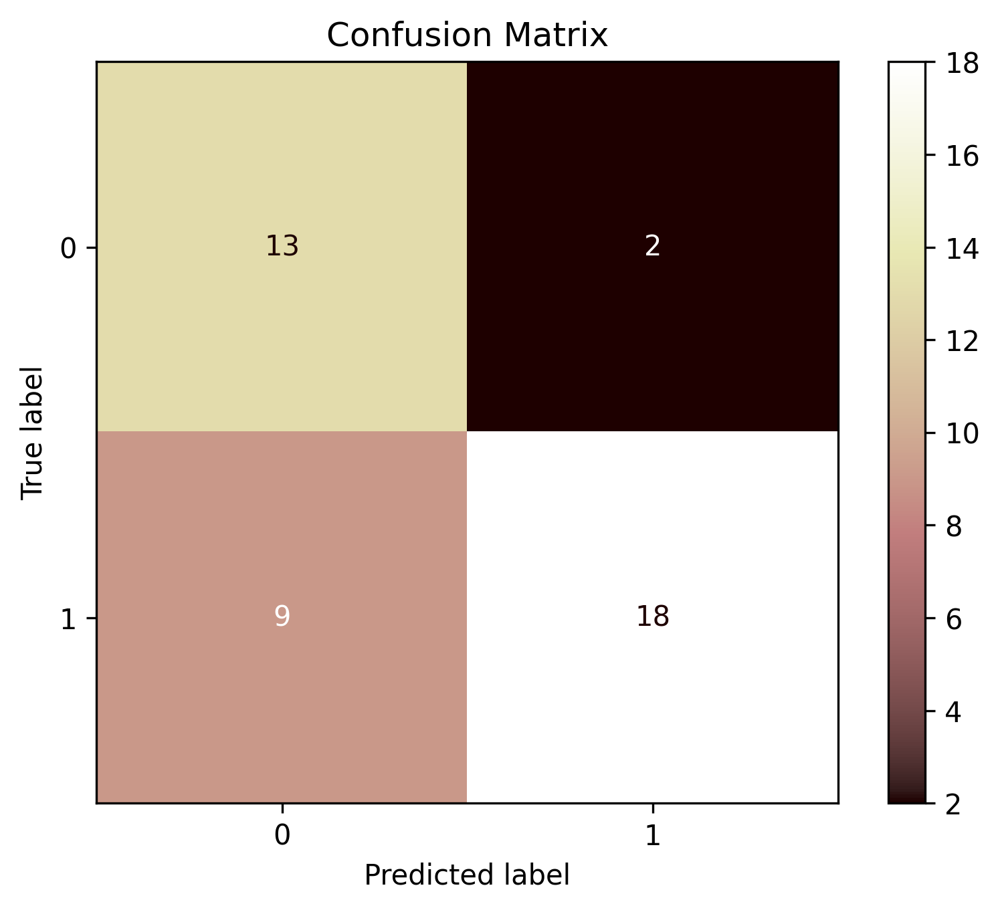

#  Sonar Rock vs Mine Classification App (Logistic Regression)

This project is a **Flask web application** that predicts whether a given sonar signal corresponds to a **rock** or a **mine**, using a custom-built logistic regression model from scratch.

---

##  How to download this repository

```bash
git clone https://github.com/yourusername/sonar-rock-classifier.git
cd sonar-rock-classifier
```

##  Model accuracy

The logistic regression model was evaluated on a held-out test set.

**Test accuracy:** ~78.57%

### Confusion Matrix
The model's confusion matrix on test data:


